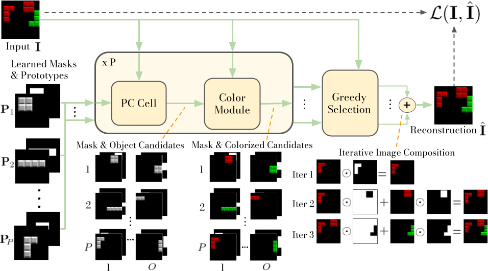
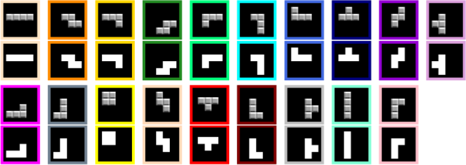
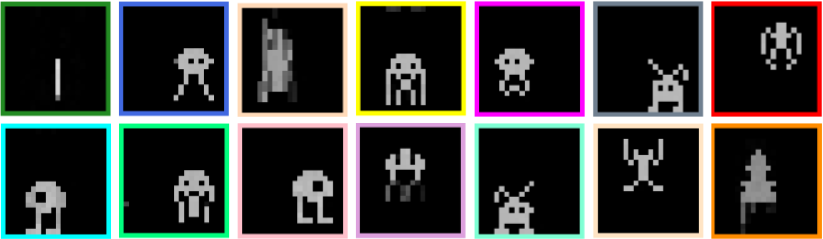
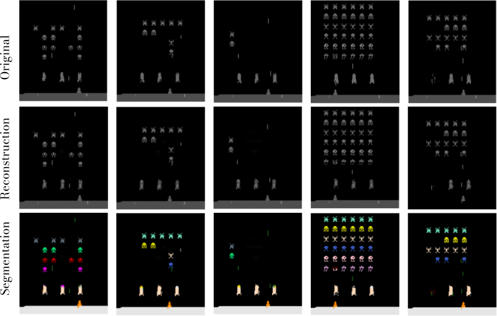

# PCDNet


This respository contains the main codebase for the paper: *Unsupervised Image Decomposition with Phase-Correlation Networks*.
[Paper](https://arxiv.org/abs/2110.03473)

The repository allows to reproduce the experiments and results from the paper.



## Contents

 * [1. Getting Started](#getting-started)
 * [2. Directory Structure](#directory-structure)
 * [3. Quick Guide](#quick-guide)
 * [4. Citation](#citation)
 * [5. Contact](#contact)


 ## Getting Started

 To download the code, fork the repository or clone it using the following command:

 ```
   git clone git@github.com:angelvillar96/Unsupervised-Decomposition-PCDNet.git
 ```


 ### Prerequisites

 To get the repository running, you will need several python packages, e.g., Numpy, OpenCV PyTorch or Matplotlib.

 You can install them all easily and avoiding dependency issues by installing the conda environment file included in the repository. To do so, run the following command from the Conda Command Window or from a Terminal:

 ```shell
 $ conda env create -f environment.yml
 $ conda activate TODO
 ```

 *__Note__:* This step might take a few minutes


 ## Directory Structure

 The following tree diagram displays the detailed directory structure of the project. Some directory names and paths can be modified in the [CONFIG File](https://github.com/angelvillar96/Unsupervised-Decomposition-PCDNet/blob/master/src/CONFIG.py).

 ```
 ScatClustering
 |
 ├── resources/
 |
 ├── datasets/
 |   ├── AAD/  
 |   ├── Tetrominoes/  
 |   └── cars/  
 |
 ├── models/
 |
 ├── src/
 |   ├── data/  
 |   |    ├── atari.py
 |   |    └── ...
 │   |── lib/
 |   |    ├── arguments.py
 |   |    └── ...
 │   |── models/
 |   |    ├── PhaseCorrelationCell.py
 |   |    └── ...
 |   |
 |   |── notebooks/
 |   |    ├── TODO
 |   |    └── ...
 |   |
 │   ├── 01_create_experiment.py
 │   ├── 02_train.py
 │   ├── 03_evaluate.py
 │   └── 04_generate_figures.py
 |
 ├── environment.yml
 └── README.md
 ```


Now, we give a short overview of the different directories:

- **resources/**: Images from the README.md file

- **datasets/**: Image datasets used in the paper. It can be downloaded from [here TODO](TODO)

- **models/**: Experiments and pretrained models

- **src/**: Code to reproduce the results from the paper.


## Quick Guide

In this section, we explain how to use the repository to reproduce the experiments from the paper. For other detailed
guides, we refer to these explanatory [TODO](TOOD).

### TODO...








## Citation
Please consider citing our paper if you find our work or our repository helpful.
```
@article{villar2021PCDNet,
  title={Unsupervised Image Decomposition with Phase-Correlation Networks},
  author={Villar-Corrales, Angel and Behnke, Sven},
  journal={arXiv preprint arXiv:2110.03473},
  year={2021}
}
```


## Contact

This repository is maintained by [Angel Villar-Corrales](http://angelvillarcorrales.com/templates/home.php),

In case of any questions or problems regarding the project or repository, do not hesitate to contact the authors at villar@ais.uni-bonn.de.
